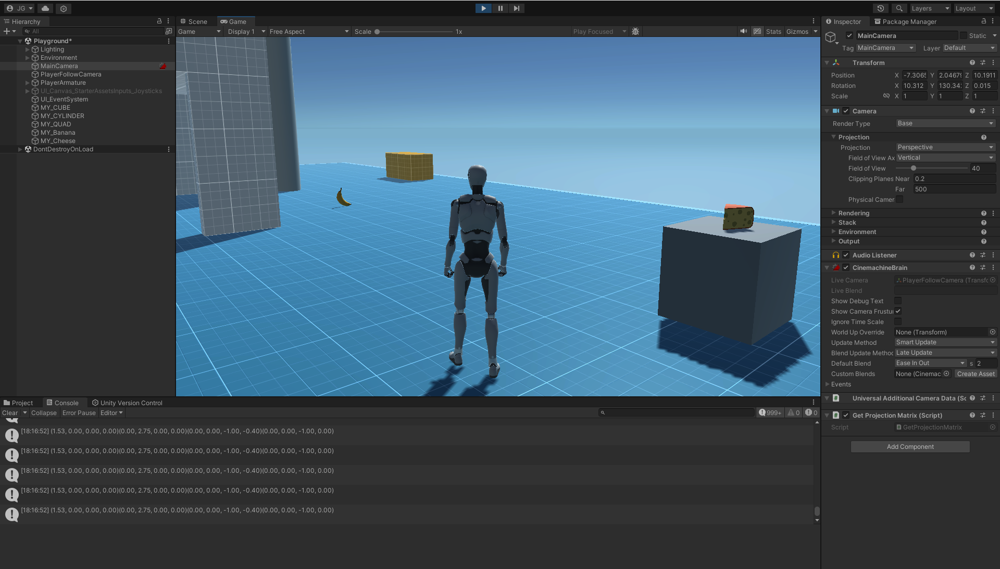
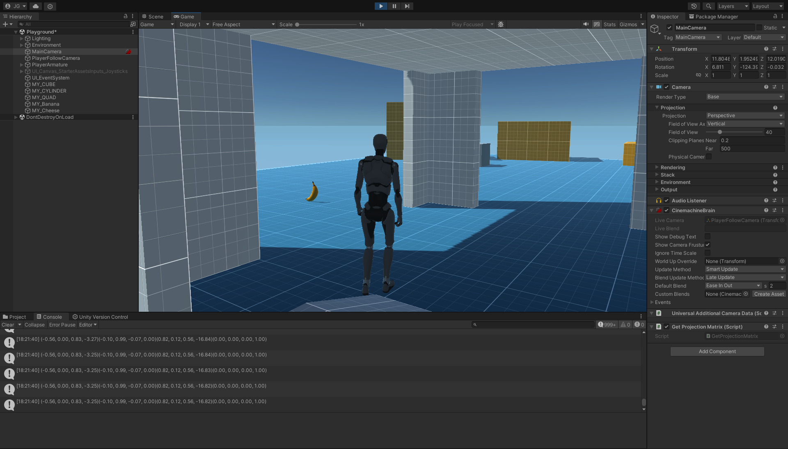

# Introducción a la programación de gráficos 3D

 ***1. Qué funciones se pueden usar en los scripts de Unity para llevar a cabo traslaciones, rotaciones y escalados.***

*a. Traslaciones:* `transform.Translate()`

Se represente a través de la siguiente matriz: 

$$\begin{pmatrix} 
1 & 0 & 0 & 0\\
0 & 1 & 0 & 0\\
0 & 0 & 1 & 0\\
t_x & t_y & t_z & 1
\end{pmatrix}$$

Donde $$(t_x, t_y, t_z)$$ es el vector de desplazamiento.

*b. Rotaciones:* `transform.Rotate()`

Matriz de rotación 2D: 

$$\begin{pmatrix}
\cos \phi & \sin \phi & 0\\
\sin \phi & \cos \phi & 0\\
t_x & t_y & 1
\end{pmatrix}$$

Donde $$\phi$$ es el angulo de la rotacion.
Para representar las rotaciones 3D se emplean 3 matrices distintas y dependiendo de la escogida la rotación se realiza en el plano y-z sobre el eje x, x-z sobre el eje y o x-y sobre el eje z.

*c. Escalado:* `GameObject object`: `object.transform.localScale += new Vector3(s_x, s_y, s_z)`

$$\begin{pmatrix}s_x & 0 & 0 & 0\\
0 & s_y & 0 & 0\\
0 & 0 & s_z & 0\\
0 & 0 & 0 & 1
\end{pmatrix}$$

Donde $$(s_x, s_y, s_z)$$ es el vector de escala.

***2. Como trasladarías la cámara 2 metros en cada uno de los ejes y luego la rotas 30º alrededor del eje Y?. Rota la cámara alrededor del eje Y 30ª y desplázala 2 metros en cada uno de los ejes. ¿Obtendrías el mismo resultado en ambos casos?. Justifica el resultado.***

Para trasladar necesitamos la siguiente matriz:

$$T =\begin{pmatrix}
1 & 0 & 0 & 0\\
0 & 1 & 0 & 0\\
0 & 0 & 1 & 0\\
2 & 2 & 2 & 1
\end{pmatrix}$$

y para rotar esta:

$$R =\begin{pmatrix}
\cos 30 & 0 & \sin 30 & 0\\
0 & 1 & 0 & 0\\
-\sin 30 & 0 & \cos 30 & 0\\
0 & 0 & 0 & 1
\end{pmatrix}$$

Teniendo el punto $$p = (x,y,z)$$, que es donde se encuentra la cámara, y queremos realizar las operaciones anteriores, tenemos que multiplicar el punto con las matrices.

*a. Primero trasladar, luego rotar:*

$$(x,y,z,1) \cdot T \cdot R = (x,y,z,1) \cdot 
\begin{pmatrix}
\cos(30) & 0 & \sin 30 & 0\\
0 & 1 & 0 & 0\\
-\sin 30 & 0 & \cos 30 & 0\\
2 (\cos 30 - \sin 30) & 2 & 2 (\sin 30 + \cos 30) & 1
\end{pmatrix}$$

*b. Primero rotar, luego trasladar:*

$$(x,y,z,1) \cdot R \cdot T = (x,y,z,1) \cdot 
\begin{pmatrix}
\cos 30 & 0 & \sin 30 & 0\\
0 & 1 & 0 & 0\\
-\sin 30 & 0 & \cos 30 & 0\\
2 & 2 & 2 & 1
\end{pmatrix}$$

Podemos ver que los matrices son diferentes por lo que no se obtienen los mismos resultados al hacer las transformaciones en distintos orden. La multiplicacion de matrices no es conmutativa.

***3. Sitúa la esfera de radio 1 en el campo de visión de la cámara y configura un volumen de vista que la recorte parcialmente.***

Por ejemplo: tenenmos la esfera en la posición $$p = (0,2,0)$$ y la cámara en $$q = (0,0,-10)$$.

Si cambiamos el plano cerca en $$z=9.7$$, recortamos la esfera:

Imagen de unity:

***4. Sitúa la esfera de radio 1 en el campo de visión de la cámara y configura el volumen de vista para que la deje fuera de la vista.***

La esfera y la cámara tienen la misma posición.

Por ejemplo podemos cambiar el plano cerca en $$z=20$$ y la esfera está fuera de la vista.

También es posible el plano lejos está en $$z=9$$ y tampoco podemos ver la esfera en la vista.

***5. Como puedes aumentar el ángulo de la cámara. Qué efecto tiene disminuir el ángulo de la cámara.***

Aumentando el ángulo de apertura (en inglés y en Unity se llama "Field of View").
Cuando se aumenta el ángulo, el campo de visión aumenta y los objectos se ven más pequeños. 
Cuando disminuye el ángulo de la cámara, vemos menos del campo de visión y los objetos parecen más grandes en nuestra vista.

Ejemplos de unity:

1. Àngulo de cámara pequeño (15 grados)

2. Àngulo grande (160 grados)

***6. Es correcta la siguiente afirmación: Para realizar la proyección al espacio 2D, en el inspector de la cámara, cambiaremos el valor de projection, asignándole el valor de orthographic.***

No es correcta porque ortogonal significa que se conservan medidas pero no se almacena información de distancias. Esta técnica es apropiada para programas de diseño.

Es mejor elegir el valor "Perspective", así los objetos más cercanos a la cámara se verán mayores y los más lejanos más pequeños, como en la realidad. Esto es apropiado para gráficos 3D.

***7. Especifica las rotaciones que se han indicado en los ejercicios previos con la utilidad quaternion.***

No sé?

***8. ¿Como puedes averiguar la matriz de proyección en perspectiva que se ha usado para proyectar la escena al último frame renderizado?***

A través de la propiedad `Camera.previousViewProjectionMatrix` de la cámara.

***9. ¿Como puedes averiguar la matriz de proyección en perspectiva ortográfica que se ha usado para proyectar la escena al último frame renderizado?.***

Igual que el apartado anterior pero esta vez hay que cambiar la propiedad `Camera.orthographic = true`, así la cámara pasa a ser ortogonal y nos dará la correspondiente matriz a través de la propiedad `Camera.previousViewProjectionMatrix`

***10. ¿Cómo puedes obtener la matriz de transformación entre el sistema de coordenadas local y el mundial?***

Para cambiar un punto del sistema mundial al local a través de `Transform.worldToLocalMatrix` y para la operación contraria se usa `Transform.localToWorldMatrix`.

***11. Cómo puedes obtener la matriz para cambiar al sistema de referencia de vista.***

La propiedad `Camera.worldToCameraMatrix` de la cámara es la matriz que permite pasar del sistema mundial al de la cámara.

***12. Especifica la matriz de la proyección usado en un instante de la ejecución del ejercicio 1 de la práctica 1.***

Esta matriz obtenemos con `cam.projectionMatrix`
$$\begin{pmatrix}
1.53 & 0 & 0 & 0\\
0 & 2.75 & 0 & 0\\
0 & 0 & -1 & -0.4\\
0 & 0 & -1 & 0
\end{pmatrix}$$

***13. Especifica la matriz de modelo y vista de la escena del ejercicio 1 de la práctica 1.***

1. matriz de modelo

no sé?

2. matriz de vista

Esta matriz obtenemos con `cam.worldToCameraMatrix`
$$\begin{pmatrix}
-0.56 & 0 & 0.83 & -3.25\\
-0.10 & 0.99 & -0.07 & 0\\
0.82 & 0.12 & 0.56 & -16.82\\
0 & 0 & 0 & 1
\end{pmatrix}$$

***14. Aplica una rotación en el start de uno de los objetos de la escena y muestra la matriz de cambio al sistema de referencias mundial.***

TBD

***15. ¿Como puedes calcular las coordenadas del sistema de referencia de un objeto con las siguientes propiedades del Transform:?: Position (3, 1, 1), Rotation (45, 0, 45)***

TBD
